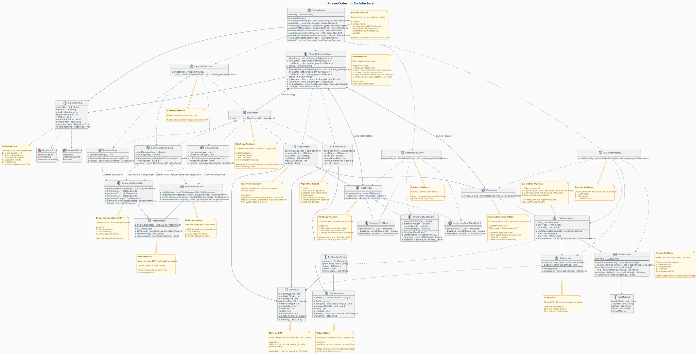

<!-- markdownlint-disable MD033 -->
<!-- markdownlint-disable MD041 -->

<a id="readme-top"></a>

[![C++][cpp-shield]][cpp-url]
[![LLVM][llvm-shield]][llvm-url]
[![CMake][cmake-shield]][cmake-url]
[![Benchmark][benchmark-shield]][benchmark-url]
[![Tests][tests-shield]][tests-url]

<br />
<div align="center">
  

  <h3 align="center">Phase-Ordering Problem Solver</h3>
  <h4 align="center">LLVM Optimization Sequence Search Framework</h4>

<div align="center">

**Automatic LLVM Pass Sequence Optimization Using Heuristic Search Algorithms**

[Getting Started](#getting-started) • [Architecture](#architecture) • [Algorithms](#implemented-methods) • [Results](#results)

</div>
</div>

<details>
  <summary>Table of Contents</summary>
  <ol>
    <li><a href="#about-the-project">About The Project</a>
      <ul>
        <li><a href="#key-features">Key Features</a></li>
      </ul>
    </li>
    <li><a href="#problem-statement">Problem Statement</a>
    <li><a href="#architecture">Architecture</a>
      <ul>
        <li><a href="#module-structure">Module Structure</a></li>
      </ul>
    </li>
    <li><a href="#implemented-methods">Implemented Methods</a></li>
    <li><a href="#getting-started">Getting Started</a>
      <ul>
        <li><a href="#prerequisites">Prerequisites</a></li>
        <li><a href="#building-from-source">Building from Source</a></li>
      </ul>
    </li>
    <li><a href="#usage">Usage</a></li>
    <li><a href="#results">Results</a></li>
    <li><a href="#roadmap">Roadmap</a></li>
    <li><a href="#troubleshooting">Troubleshooting</a></li>
    <li><a href="#contributing">Contributing</a></li>
    <li><a href="#references">References</a></li>
  </ol>
</details>

---

## About The Project

The **Phase-Ordering Problem Solver** is a research-oriented framework that automatically discovers optimal sequences of LLVM optimization passes. Modern compilers apply dozens of transformations (e.g., `mem2reg`, `instcombine`, `gvn`, `licm`), and the order in which these passes are applied critically affects the quality of the generated code. This project addresses the NP-hard problem of finding the optimal pass sequence through heuristic search algorithms, providing compiler researchers and developers with a tool to explore optimization spaces systematically.

### Key Features

| Feature                        | Description                                                                  |
| ------------------------------ | ---------------------------------------------------------------------------- |
| **LLVM Integration**           | Direct integration with real LLVM tools (`clang`, `opt`, `lli`, `llvm-link`) |
| **Multiple Search Algorithms** | Random Search, Hill Climbing, Simulated Annealing                            |
| **Flexible Cost Models**       | Instruction count, weighted metrics, runtime-based evaluation                |
| **Batch Experimentation**      | Run experiments across multiple programs, configurations, and repetitions    |
| **Parallel Execution**         | Multi-threaded experiment runner with configurable job count                 |
| **CSV Export**                 | Raw results and comparison matrices with statistics                          |
| **Modular Design**             | Easily extensible with new algorithms, cost models, or evaluators            |
| **Testing & Benchmarking**     | Google Test suite and Google Benchmark integration                           |

<p align="right">(<a href="#readme-top">back to top</a>)</p>

---

## Problem Statement

### The Phase-Ordering Problem

Modern compilers consist of hundreds of optimization passes. The sequence in which these passes are applied dramatically impacts final code quality:

```
mem2reg → instcombine → gvn → simplifycfg → licm → dce    (Good)
vs.
gvn → mem2reg → dce → licm → instcombine → simplifycfg   (Poor)
```

**Why is this hard?**

- **Combinatorial explosion**: With N passes, there are N! possible sequences
- **Non-linear interactions**: Passes can enable or disable each other's optimizations
- **Program-dependent**: Optimal order varies by input program characteristics
- **Resource constraints**: Each evaluation requires running LLVM `opt` and analyzing IR

### Our Approach

The framework treats phase-ordering as a black-box optimization problem:

1. **Search space**: All sequences of passes from a predefined registry (length ≤ 30)
2. **Objective function**: Cost model scores (lower is better) based on IR metrics or runtime
3. **Search strategies**: Heuristic algorithms that balance exploration and exploitation

<p align="right">(<a href="#readme-top">back to top</a>)</p>

---

## Architecture

### High-Level Pipeline



### Module Structure

| Module           | File                        | Responsibility                                         |
| ---------------- | --------------------------- | ------------------------------------------------------ |
| **Interfaces**   | `interfaces.hpp`            | `IAlgorithm`, `IEvaluator`, `ICostModel` abstractions  |
| **Algorithms**   | `algorithms.cpp`            | Random Search, Hill Climbing, Simulated Annealing      |
| **Cost Models**  | `cost_models.cpp`           | Weighted, instruction count, runtime scoring           |
| **LLVM Facade**  | `llvm_facade.cpp`           | Wrapper for `clang`, `opt`, `lli`, `llvm-link`         |
| **IR Analyzer**  | `ir_analyzer.cpp`           | Pattern-based LLVM IR metric extraction                |
| **Sequence Ops** | `sequence_ops.cpp`          | Pass registry, sequence generation, mutation operators |
| **Evaluator**    | `evaluator_impl.cpp`        | Real LLVM evaluation of optimization sequences         |
| **Solver**       | `solver.cpp`                | Orchestration of compilation, evaluation, and search   |
| **Experiment**   | `cli_flags.cpp`, `main.cpp` | CLI parsing, batch experiments, CSV output             |

### Key Design Decisions

1. **Black-box evaluation**: Each sequence evaluation runs actual LLVM `opt`, ensuring realistic measurements
2. **Empty sequence baseline**: Always runs through `opt` (even empty sequence) for canonicalized IR and comparable metrics
3. **Validation layers**: Multiple checks for IR validity (function definitions, instruction count > 0) prevent silent failures
4. **Timeout support**: Uses `timeout`/`gtimeout` to prevent hanging evaluations
5. **Version-aware tool discovery**: Automatically finds `clang-18`, `opt-18`, etc.

<p align="right">(<a href="#readme-top">back to top</a>)</p>

---

## Implemented Methods

### Search Algorithms

#### Random Search

Baseline method that generates random sequences and keeps the best. Includes:

- Initial seeding with O1/O2/short random sequences
- Two-phase strategy: random exploration → mutation of best
- Budget splitting (50% explore, 50% exploit)

#### Hill Climbing

Local search that iteratively improves a candidate:

- Starts from O2/O1/random seeds
- Applies mutations (insert/remove/swap/change)
- Accepts only improving moves
- Multiple restarts to escape local optima
- Stops after `maxNoImprove` consecutive failures

#### Simulated Annealing

Probabilistic search that accepts worse solutions early:

- Temperature starts high (exploration), cools exponentially
- Acceptance probability = `exp(-Δ / temperature)`
- Balances exploration vs. exploitation
- Effective for large, complex search spaces

### Cost Models

| Model                | Formula                                                        | Use Case                                   |
| -------------------- | -------------------------------------------------------------- | ------------------------------------------ |
| **InstructionCount** | `instr_opt / instr_base`                                       | Quick metric, good proxy for code size     |
| **Weighted**         | `w₁·instr + w₂·mem + w₃·branch + w₄·runtime`                   | Balanced optimization (default: 3:1.5:1:0) |
| **Runtime**          | `runtime_opt / runtime_base` (falls back to instruction count) | Execution time minimization                |

### LLVM Pass Registry

The framework includes 45+ passes covering:

- **Scalar optimizations**: `mem2reg`, `instcombine`, `gvn`, `sroa`, `dce`, `adce`
- **Loop optimizations**: `licm`, `loop-unroll`, `loop-rotate`, `loop-distribute`, `loop-vectorize`
- **Vectorization**: `slp-vectorizer`, `loop-vectorize`
- **IPO**: `inline`, `globalopt`, `globaldce`, `mergefunc`
- **CFG**: `simplifycfg`, `jump-threading`, `unreachableblockelim`

<p align="right">(<a href="#readme-top">back to top</a>)</p>

---

## Getting Started

### Prerequisites

| Tool                 | Version | Ubuntu/Debian                       | macOS (Homebrew)            |
| -------------------- | ------- | ----------------------------------- | --------------------------- |
| **CMake**            | ≥ 3.16  | `sudo apt install cmake`            | `brew install cmake`        |
| **LLVM/Clang**       | ≥ 14    | `sudo apt install llvm clang lld`   | `brew install llvm`         |
| **C++ Compiler**     | C++20   | `sudo apt install g++-13`           | Xcode or `brew install gcc` |
| **Git**              | latest  | `sudo apt install git`              | `brew install git`          |
| **GoogleTest**       | latest  | `sudo apt install libgtest-dev`     | `brew install googletest`   |
| **Google Benchmark** | latest  | `sudo apt install libbenchmark-dev` | `brew install benchmark`    |

### Platform-Specific Notes

#### Linux (Ubuntu 22.04+)

```bash
# Install dependencies
sudo apt update
sudo apt install cmake llvm-18 clang-18 lld-18 libgtest-dev libbenchmark-dev

# Set LLVM path (adjust version)
export LLVM_BIN_PATH=/usr/lib/llvm-18/bin
```

#### macOS

```bash
# Install dependencies via Homebrew
brew install llvm cmake googletest benchmark

# LLVM is keg-only, add to PATH
export PATH="/opt/homebrew/opt/llvm/bin:$PATH"
export LDFLAGS="-L/opt/homebrew/opt/llvm/lib"
export CPPFLAGS="-I/opt/homebrew/opt/llvm/include"
```

#### Windows (WSL2 recommended)

Use Windows Subsystem for Linux with Ubuntu 22.04, then follow Linux instructions.

### Building from Source

```bash
# Clone repository
git clone https://github.com/rogovogor17/Phase-ordering-Problem
cd Phase-ordering-Problem

# Create build directory
mkdir build && cd build

# Configure
cmake ..

# Build
cmake --build .

# Verify build
./bin/phaseordering --help

#Install on device with root prior
cmake --install .
```

### Building Tests & Benchmarks

```bash
# Tests are built automatically
ctest --output-on-failure

# Build benchmarks separately
cmake --build . --target phaseordering_bench
./benchmark/phaseordering_bench
```

<p align="right">(<a href="#readme-top">back to top</a>)</p>

---

## Usage

### Basic Usage

```bash
# Optimize a single C++ file
./bin/phaseordering --source test.cpp

# With custom flags
./bin/phaseordering --source test.cpp --cflags "-Iinclude -std=c++17"

# Specify LLVM path
./bin/phaseordering --source test.cpp --llvm-path /usr/lib/llvm-18/bin
```

### Algorithm Selection

```bash
# Random Search
./bin/phaseordering --source test.cpp --algorithm random

# Hill Climbing
./bin/phaseordering --source test.cpp --algorithm hillclimbing

# Simulated Annealing (default)
./bin/phaseordering --source test.cpp --algorithm sa

# Compare multiple algorithms
./bin/phaseordering --source test.cpp --algorithm random,hillclimbing,sa
```

### Cost Model Selection

```bash
# Instruction count (minimize code size)
./bin/phaseordering --source test.cpp --costmodel instructions

# Weighted (balanced: instructions + memory + branches)
./bin/phaseordering --source test.cpp --costmodel weighted
```

### Advanced Configuration

```bash
# Control search budget
./bin/phaseordering --source test.cpp \
  --max-eval 500 \
  --seq-len 25

# Verbose output (shows each evaluation)
./bin/phaseordering --source test.cpp --verbose

# Quiet mode (summary only)
./bin/phaseordering --source test.cpp --quiet
```

### Batch Experiments

#### Sources List File Format

Create a text file (e.g., `benchmarks.txt`):

```text
# Comments start with #
CFLAGS=-Iinclude -std=c++17

# Single file
polybench/2mm.c

# Directory (recursively scans .c/.cpp)
polybench/stencils/

# Project with custom flags
@matmul -O2 -march=native:
    src/matmul.cpp
    src/utils.cpp

# IR file directly
--ir matmul.ll
```

#### Running Batch Experiments

```bash
./bin/phaseordering \
  --sources-list benchmarks.txt \
  --algorithm sa,hc,random \
  --costmodel weighted,instructions,runtime \
  --max-eval 100,300,500 \
  --seq-len 10,20,30 \
  --repeat 5 \
  --jobs 4 \
  --csv results.csv \
  --tee-log experiment.txt \
  --output-dir ./experiments
```

### Output Files

| File                 | Description                                                    |
| -------------------- | -------------------------------------------------------------- |
| `results.csv`        | Raw per-run data (algorithm, cost model, metrics, sequence)    |
| `results_matrix.csv` | Aggregated comparison matrix with baseline rows and statistics |
| `experiment.log`     | Full experiment log with timestamps                            |
| `optimization.log`   | Per-run algorithm details (with `--verbose`)                   |
| `initial_ir.ll`      | Saved initial IR (with `--verbose`)                            |
| `optimized_ir.ll`    | Saved best IR (with `--verbose`)                               |

### Interpreting Results

**Raw CSV columns:**

- `improvement_pct`: (baseline - optimized) / baseline × 100%
- `best_score`: Cost model score (lower is better)
- `best_seq`: Discovered optimization sequence

**Matrix CSV sections:**

- `improvement_pct`: Higher is better (optimization success)
- `optimized_instructions`: Lower is better (code size)
- `elapsed_time`: Lower is better (search speed)
- `runtime_ms`: Lower is better (execution speed)

<p align="right">(<a href="#readme-top">back to top</a>)</p>

---

## Results

### Example Output

```
phaseordering --sources-list temp/config.txt --output-dir temp --repeat 5 --jobs 5
=== Phase-Ordering Experiment ===
Programs: 1 | Configs: 1 | Repeats: 5 | Total: 5 | Jobs: 5
  [1] algorithms.cpp (1 file(s)) cflags=[-I include]
  SimulatedAnnealing_Weighted_ev300_len20
=================================

[INFO] Starting optimization with SimulatedAnnealing algorithm
[INFO] Starting optimization with SimulatedAnnealing algorithm
[INFO] Starting optimization with SimulatedAnnealing algorithm
[INFO] Starting optimization with SimulatedAnnealing algorithm
[INFO] Starting optimization with SimulatedAnnealing algorithm
[INFO] Baseline metrics collected (7175 instructions)
[INFO] Baseline metrics collected (7175 instructions)
[INFO] Baseline metrics collected (7175 instructions)
[INFO] Baseline metrics collected (7175 instructions)
[INFO] Baseline metrics collected (7175 instructions)

========================================
       OPTIMIZATION RESULT
========================================
  Best sequence: mergefunc -> gvn
  Best score:    5.4138
  Evaluations:   235
  Improvement:   +1.62%
========================================
[1/5] SimulatedAnnealing_Weighted_ev300_len20 algorithms.cpp r0 OK impr=1% 7175->7059 31332ms

========================================
       OPTIMIZATION RESULT
========================================
  Best sequence: always-inline -> simplifycfg -> inline -> globaldce -> partially-inline-libcalls -> mergefunc -> sroa -> deadargelim
  Best score:    5.4057
  Evaluations:   247
  Improvement:   +1.77%
========================================

========================================
       OPTIMIZATION RESULT
========================================
  Best sequence: globaldce
  Best score:    5.4920
  Evaluations:   250
  Improvement:   +0.15%
========================================
[2/5] SimulatedAnnealing_Weighted_ev300_len20 algorithms.cpp r2 OK impr=1% 7175->7048 32980ms
[3/5] SimulatedAnnealing_Weighted_ev300_len20 algorithms.cpp r1 OK impr=0% 7175->7164 33082ms

========================================
       OPTIMIZATION RESULT
========================================
  Best sequence: globaldce
  Best score:    5.4920
  Evaluations:   248
  Improvement:   +0.15%
========================================
[4/5] SimulatedAnnealing_Weighted_ev300_len20 algorithms.cpp r3 OK impr=0% 7175->7164 33255ms

========================================
       OPTIMIZATION RESULT
========================================
  Best sequence: globaldce -> adce -> loop-unroll
  Best score:    5.4920
  Evaluations:   248
  Improvement:   +0.15%
========================================
[5/5] SimulatedAnnealing_Weighted_ev300_len20 algorithms.cpp r4 OK impr=0% 7175->7164 33378ms

========================================
       EXPERIMENT SUMMARY
========================================
  Runs:           5 total, 5 ok, 0 fail

  --- Improvement ---
  Average:   0.77%
  Median:    0.15%
  Best:      1.77%
  Worst:     0.15%

  --- Instructions ---
  Avg baseline:  7175
  Avg optimized: 7119
  Avg reduction: 0.8%

  --- Performance ---
  Avg time/run:  32806 ms
  Avg evals/run: 246

  Per-run results:
  Config                   File            Ok?   Impr%      ms
  -------------------------------------------------------------
  SimulatedAnnealing_Weighted_ev300_len20algorithms..     OK    1.6%   31332
  SimulatedAnnealing_Weighted_ev300_len20algorithms..     OK    1.8%   32980
  SimulatedAnnealing_Weighted_ev300_len20algorithms..     OK    0.2%   33082
  SimulatedAnnealing_Weighted_ev300_len20algorithms..     OK    0.2%   33255
  SimulatedAnnealing_Weighted_ev300_len20algorithms..     OK    0.2%   33378
========================================

Total wall time: 33498 ms
```

### Observed Patterns

1. **Early canonicalization** (`mem2reg`, `instcombine`) consistently improves results
2. **Loop optimizations** (`licm`, `loop-unroll`) are critical for numerical kernels
3. **Duplicate passes** sometimes help (e.g., repeated `simplifycfg` + `instcombine`)
4. **Simulated Annealing** outperforms Hill Climbing on complex programs by 5-10%
5. **Weighted cost model** produces more balanced code than pure instruction count

<p align="right">(<a href="#readme-top">back to top</a>)</p>

---

## Roadmap

### Completed

- [x] Core LLVM integration (clang, opt, lli, llvm-link)
- [x] IR analysis and metric extraction
- [x] Random Search, Hill Climbing, Simulated Annealing
- [x] Three cost models (instruction count, weighted, runtime)
- [x] Batch experiment framework
- [x] CSV export with statistics
- [x] Parallel execution (multi-threaded)
- [x] Google Test suite (100% pass rate)
- [x] Google Benchmark integration
- [x] Version-aware tool discovery
- [x] Timeout support for hanging evaluations

### In Progress

- [ ] Genetic Algorithm implementation
- [ ] Multi-objective optimization
- [ ] Caching of evaluated sequences
- [ ] LLVM New Pass Manager support

### Planned

- [ ] Reinforcement Learning
- [ ] ML-guided initialization from program features
- [ ] Transfer learning across similar programs
- [ ] Distributed experiment runner
- [ ] Web dashboard for result visualization
- [ ] Integration with MLIR
- [ ] GPU kernel optimization support

### Research Directions

- **Feature extraction**: Use program characteristics (loop count, memory footprint, branch density) to predict optimal initial sequences
- **Adaptive search**: Dynamically adjust mutation rates and acceptance probabilities based on search progress
- **Ensemble methods**: Combine multiple algorithms with different exploration/exploitation tradeoffs
- **Online learning**: Update search strategy based on successful patterns discovered during optimization

<p align="right">(<a href="#readme-top">back to top</a>)</p>

---

## Troubleshooting

### Common Issues

| Problem                        | Solution                                                             |
| ------------------------------ | -------------------------------------------------------------------- |
| `clang: command not found`     | Install LLVM or use `--llvm-path`                                    |
| `opt: unknown pass name`       | LLVM version may not support a pass; check `opt --print-passes`      |
| Empty IR after compilation     | Check that source file contains a `main` function or visible symbols |
| All evaluations fail           | Verify LLVM installation and pass list compatibility                 |
| Timeout errors                 | Increase `timeoutMs` in `LLVMConfig` or simplify search space        |
| Memory leaks during batch runs | Reduce `--jobs` or use `--repeat 1` for debugging                    |

### Debugging

```bash
# Enable verbose output to see each evaluation
./bin/phaseordering --source test.cpp --verbose

# Save initial and final IR for inspection
./bin/phaseordering --source test.cpp --verbose

# Run single configuration with minimal parallelism
./bin/phaseordering --source test.cpp --jobs 1 --repeat 1
```

<p align="right">(<a href="#readme-top">back to top</a>)</p>

---

## Contributing

Contributions are welcome! Areas for contribution:

- New search algorithms (genetic, ant colony, PSO)
- Additional cost models (power consumption, cache misses)
- Support for more LLVM passes (especially target-specific ones)
- Performance optimizations (caching, parallel evaluation)
- Improved IR analysis (alias analysis, dataflow)

<p align="right">(<a href="#readme-top">back to top</a>)</p>

---

## References

1. **LLVM Documentation** — [https://llvm.org/docs/](https://llvm.org/docs/)
2. **LLVM Passes Reference** — [https://llvm.org/docs/Passes.html](https://llvm.org/docs/Passes.html)

<p align="right">(<a href="#readme-top">back to top</a>)</p>

---

<p align="center">
  <sub>© 2026 — Phase-Ordering Problem Solver | Built with LLVM, C++20, and heuristic search</sub>
</p>

[cpp-shield]: https://img.shields.io/badge/C++-20-00599C?style=for-the-badge&logo=c%2B%2B&logoColor=white
[cpp-url]: https://isocpp.org/
[llvm-shield]: https://img.shields.io/badge/LLVM-14+-262D3A?style=for-the-badge&logo=llvm&logoColor=white
[llvm-url]: https://llvm.org/
[cmake-shield]: https://img.shields.io/badge/CMake-3.16+-064F8C?style=for-the-badge&logo=cmake&logoColor=white
[cmake-url]: https://cmake.org/
[benchmark-shield]: https://img.shields.io/badge/Benchmark-Google-4285F4?style=for-the-badge&logo=google&logoColor=white
[benchmark-url]: https://github.com/google/benchmark
[tests-shield]: https://img.shields.io/badge/Tests-Google_Test-4285F4?style=for-the-badge&logo=google&logoColor=white
[tests-url]: https://github.com/google/googletest
